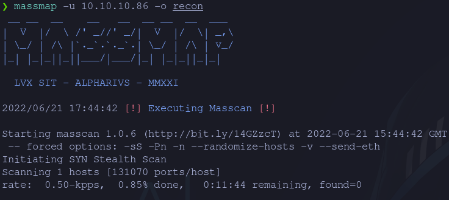
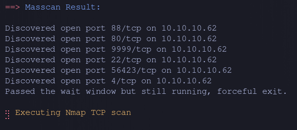
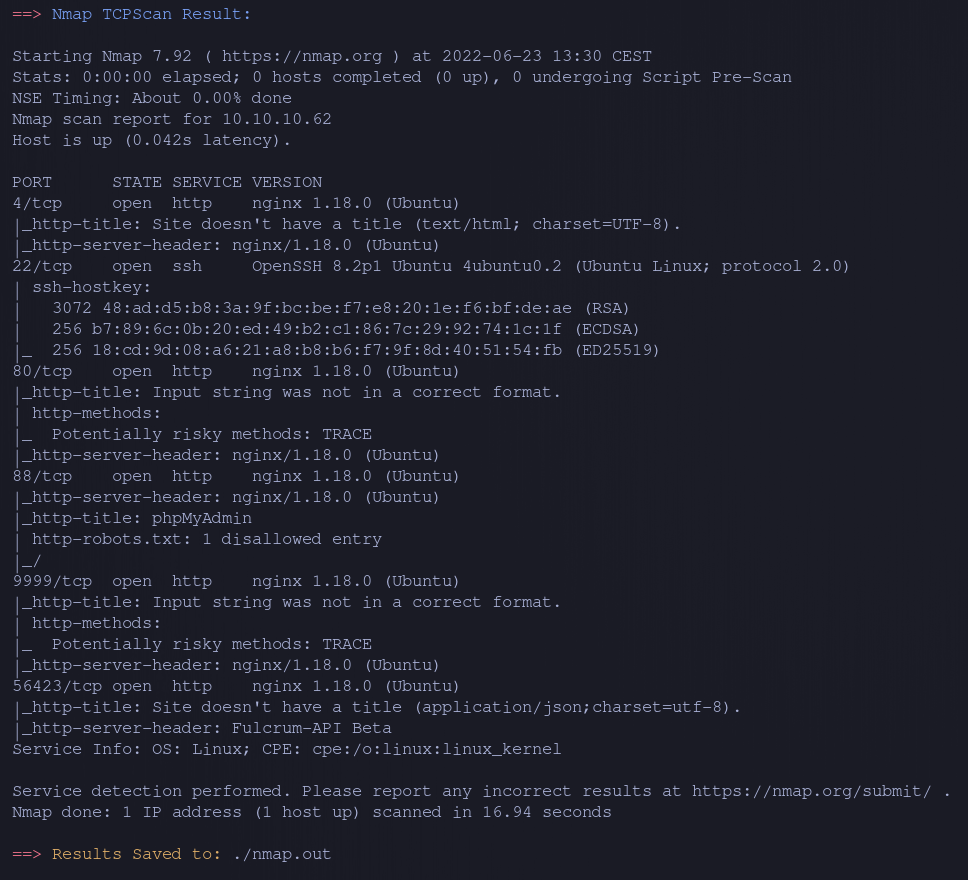

<div >
    
    
    <h1 align="center" > MassMap </h1>
</div>

## About

Massmap is a wrapper for Masscan and Nmap that takes the output from masscan and pipes it to nmap's version and script scanning

## Features
- Automatically detects if target's IP is v4 or v6
- Outputs full masscan TCP and UPD result and pipes it to nmap.
- Parses result for UDP and TCP ports and scans them with namp concurrently.
- Saves nmap result to file. 


## Why?

It's just a personal project that I made to practice go and that I use as part of my workflow when doing CTFs, it's not meant to be a replacement for any other tool but maybe a part of the code or idea can be useful for someone else who knows !!

## Usage

*[!] Masscan has an issue when stopping while using a vpn see [here](https://github.com/robertdavidgraham/masscan/issues/144), the workaround was using a docker container with an older version in order to use it uncomment the following line in '/massScan/massScan.go'.*

```go
18 - masscanCmd := fmt.Sprintf("sudo docker run -i --network host --rm adarnimrod/masscan -p1-65535,U:1-65535 %s -e %s --rate=%s --wait=5", ip, inter, rate)
```

- Clone the repo to compile it and modify it (Make sure to have golang installed!).
```bash
git clone https://github.com/Alpharivs/go-scan.git
```
- Make the changes that you want and compile.
```bash
go build -o go-scann main.go
```
- select the target plus any other custom option that you want.
```bash
❯ massmap -h
Usage of massmap:
  -e string
    	NIC for Masscan (default "tun0")
  -o string
    	Folder to save Nmap output without trailing '/' (default ".")
  -r string
    	Rate for Masscan (default "500")
  -u string
    	Target IP (Required)
```
- execute !

## Example 

Using the retired machine Fulcrum from [Hack The Box](https://app.hackthebox.com)
- Start of Scan: 
- Progress animation!: 
- Results: 
- Saved Results:
```bash
❯ ls
 nmap.out
```
<h2 align="center" > LVX-SIT</h2>
<h3 align="center" > MMDCCLXXV -- Ab urbe condita </h3>