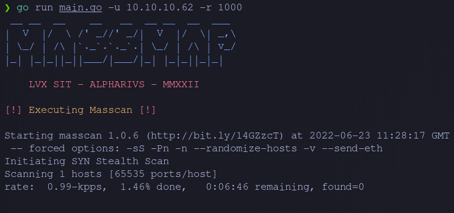

<div >
    
    
    <h1 align="center" > MassMap </h1>
</div>

## About

Massmap is a wrapper for Masscan and Nmap that takes the output from masscan and pipes it to nmap's version and script scanning

## Features
- Automatically detects if target's IP is v4 or v6
- Outputs full masscan TCP and UPD result and pipes it to nmap.
- Parses result for UDP and TCP ports and concurrently scans them with namp.
- Saves nmap results to file. 


## Why?

It's just a personal project that I made to practice go and that I use as part of my workflow when doing CTFs, it's not meant to be a replacement for any other tool but maybe a part of the code or idea can be useful for someone else who knows !!

_Disclaimer: it's just a tool for playing around in CTF's_

## Usage

*[!] Masscan has an issue when stopping while using a vpn see [here](https://github.com/robertdavidgraham/masscan/issues/144), you can simply interrupt the countdown pressing ctrl+c and it will still pipe any detected port to nmap. Alternatively you can use a dockerized version of masscan using the -docker flag*

- Clone the repo to compile it and/or modify it (Make sure to have golang installed!).
```bash
git clone https://github.com/Alpharivs/massmap.git
```
- Check that the path to your sudo binary is '/usr/bin/sudo' and if not edit it 'massScan/massScan.go', a relative path could have been used to avoid this but I'm not a fan of path hijacking ;)
```go
// Edit path if necessary
17 - sudoPath := "/usr/bin/sudo"
```
- Compile it after making the changes that you want.
```bash
go build -o massmap main.go
```
- Input the target plus any other custom option that you want.
```bash
❯ massmap -h
Usage of massmap:
  -docker
    	Use a Dockerized version of masscan.
  -e string
    	NIC for Masscan (default "tun0")
  -o string
    	Folder to save Nmap output without trailing '/' (default ".") # I will improve this function later
  -r string
    	Rate for Masscan (default "500")
  -u string
    	Target IP (Required)
```
- execute!

## Example 

Using the retired machine Fulcrum from [Hack The Box](https://app.hackthebox.com)
- Start of Scan: 


- Progress animation!: 


- Results: 


- Saved Results:
```bash
❯ ls
 nmap.out
```
<h2 align="center" > LVX-SIT</h2>
<h3 align="center" > MMDCCLXXV -- Ab urbe condita </h3>
